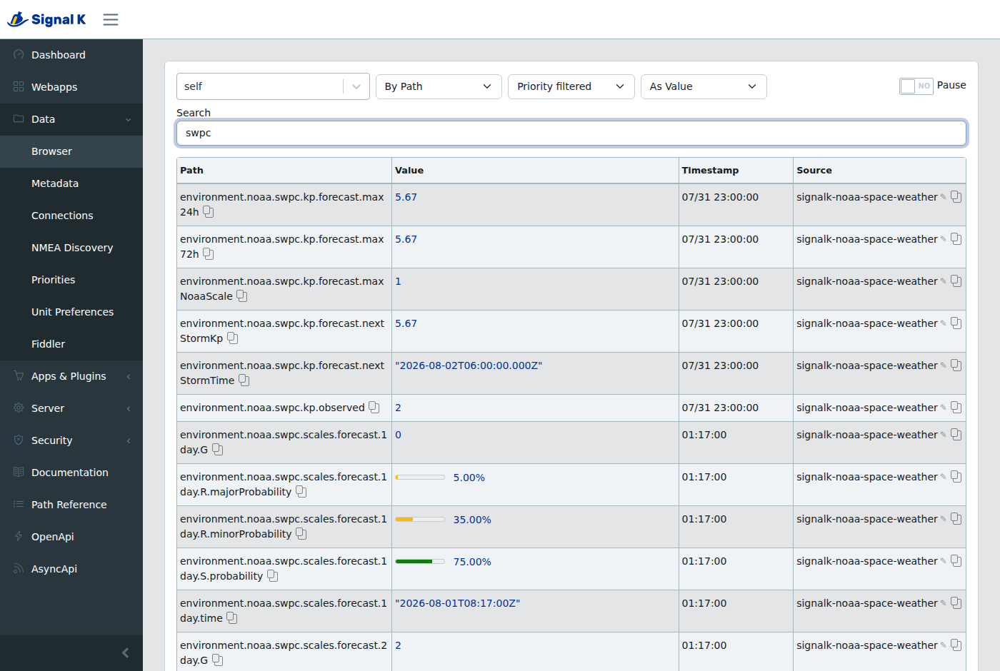
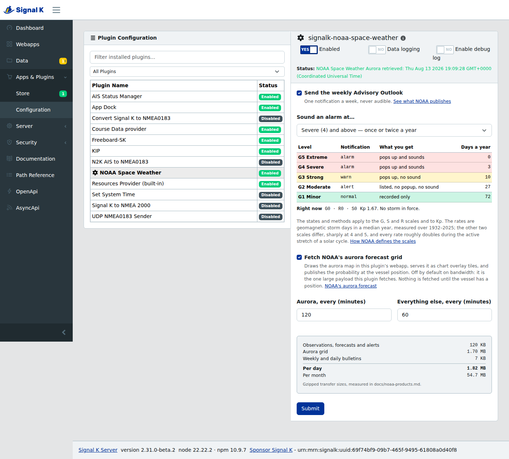
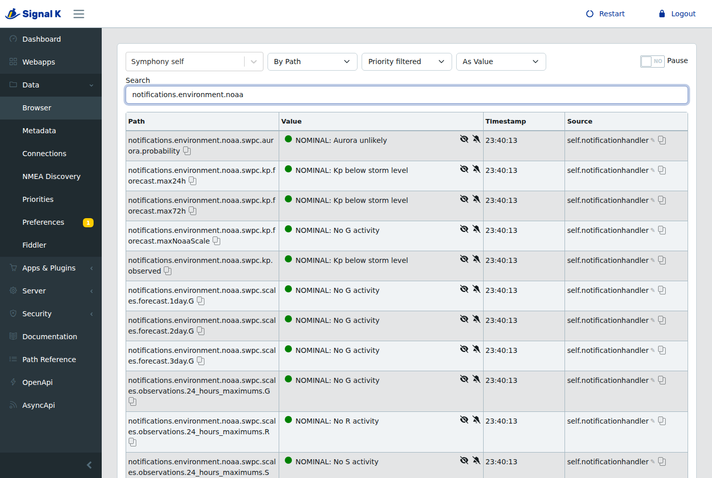

# signalk-noaa-space-weather

**Will my HF radio work tomorrow? Is my GPS about to get less accurate? Can I see the aurora from here?**

Space weather answers all three, and this plugin puts it on your boat's Signal K instance — alongside your wind, depth and AIS — so it's on the same screen as everything else you use to make a decision.

[](https://www.npmjs.com/package/signalk-noaa-space-weather)
[](LICENSE)



## Install

Signal K admin UI → **Appstore** → search *space weather* → Install. Then enable it under **Apps & Plugins → Configuration**.

It works out of the box. No account, no API key, no configuration required — NOAA's data is public and free.

## What you get

| | |
| --- | --- |
| **When the next storm hits** | `kp.forecast.nextStormTime` — a timestamp, not a vague daily outlook. Three-hourly resolution out to three days. |
| **Radio blackout risk** | The R scale, observed and forecast, with probabilities. This is the one that takes your HF out. |
| **GPS/GNSS degradation risk** | The G scale. Geomagnetic storms push position error up and can drop your fix entirely. |
| **Radiation storms** | The S scale, which also affects HF at high latitudes. |
| **Solar wind, live** | Speed, and interplanetary field strength and orientation — the leading indicators. |
| **NOAA's own alerts** | Watches, warnings and alerts as Signal K notifications, at a threshold you choose. |

Everything lands under `environment.noaa.swpc.*` with proper units and alarm zones, so **any Signal K gauge colours itself with no extra setup**.

## Who this is actually for

- **Anyone using HF/SSB** — Winlink, Pactor, weatherfax, voice nets. Radio blackouts are the most frequent space weather impact by a wide margin: an R1 happens on roughly a quarter of all days.
- **High-latitude cruisers** — the further north or south you go, the harder every one of these effects bites. Also: aurora.
- **Anyone leaning on GNSS** — single-frequency receivers degrade first, and a severe storm can take the fix out entirely.
- **Offshore passage planners** — if you're picking a departure window anyway, the Kp forecast is one more input and it's free.

## Won't this fill my screen with alarms?

No. That was a deliberate design decision, and it's backed by NOAA's own event frequencies.

| Level | How often | What the plugin does |
| --- | --- | --- |
| 1 Minor | ~1 day in 4 | Nothing. Value updates silently. |
| 2 Moderate | ~1 day in 12 | Nothing. |
| 3 Strong | ~monthly | Shows as `alert` in the UI. **No popup, no sound.** |
| 4 Severe | ~1 day in 70 | Visual notification. |
| 5 Extreme | ~4 days per solar cycle | Visual and audible. You want this one. |

Alerting on a G1 would interrupt you every four or five days forever. One setting (`zoneAlertThreshold`) moves the whole ladder if you disagree.

## Why a sailor should care at all

**Q:** *Why would I, a mere **sailor**, care about "space weather"?*

**A:** Because solar activity and geomagnetic storms directly affect satellite communication, satellite navigation, HF radio (frequently) and even VHF (rarely). Severe events can disrupt radio comms entirely, degrade or deny GPS/GNSS, damage sensitive onboard electronics, and induce stray currents in power systems afloat and ashore.

- [NOAA's Space Weather Impacts](https://www.spaceweather.gov/impacts)
- USGS: [5 Geomagnetic Storms That Reshaped Society](https://www.usgs.gov/news/featured-story/5-geomagnetic-storms-reshaped-society)
- The [Carrington Event](https://en.wikipedia.org/wiki/Carrington_Event)

Usefully, [solar cycles](https://en.wikipedia.org/wiki/Solar_cycle) run about 11 years, so periods of elevated activity are somewhat *predictable* — which is the whole premise of a forecast.

## The scales, briefly

NOAA rates three things 1–5, where 1 is Minor and 5 is Extreme:

- **G — Geomagnetic storms.** Defined directly by the Kp index (G1 = Kp5 … G5 = Kp9). Drives GNSS error and aurora.
- **S — Solar radiation storms.** Proton flux. HF at high latitudes, and a genuine radiation hazard at altitude.
- **R — Radio blackouts.** Solar X-ray flux. Sunlit-side HF degradation, from marginal to total.

Full detail: [NOAA scales explanation](https://www.spaceweather.gov/noaa-scales-explanation).

## Configuration

| Setting | Default | |
| --- | --- | --- |
| Advisory Outlook notifications | on | NOAA's weekly narrative summary |
| Alert/watch/warning notifications | off | NOAA's individual alert products |
| `minScaleAlert` | 3 | Lowest scale that raises an `alert` notification |
| `zoneAlertThreshold` | 3 | Lowest scale that escalates a gauge zone |
| Observations interval | 60 min | |
| Notifications interval | 60 min | |



## Paths

```
environment.noaa.swpc.kp.observed                        Kp now
environment.noaa.swpc.kp.forecast.max24h / .max72h       peak Kp ahead
environment.noaa.swpc.kp.forecast.nextStormTime          when G1+ starts
environment.noaa.swpc.kp.forecast.nextStormKp            how bad
environment.noaa.swpc.scales.observations.latest.{G,S,R}
environment.noaa.swpc.scales.observations.24_hours_maximums.{G,S,R}
environment.noaa.swpc.scales.forecast.{1,2,3}day.G
environment.noaa.swpc.scales.forecast.{1,2,3}day.S.probability
environment.noaa.swpc.scales.forecast.{1,2,3}day.R.{minor,major}Probability
environment.noaa.swpc.solar_wind.speed                   m/s
environment.noaa.swpc.solar_wind.Bt / .Bz                Tesla
notifications.noaa.swpc.*                                alerts and advisories
```

Values are SI. Probabilities are 0–1 ratios.



## Roadmap

- Aurora visibility **at your own position**, from NOAA's OVATION model
- A companion webapp with NOAA-style colour-coded scale meters
- More metrics where there's a case for them — X-ray flux, F10.7, D-region absorption

Ideas and bug reports welcome: [issues](https://github.com/mark-brannan/signalk-noaa-space-weather/issues).

## Development

```shell
npm install && npm run build && npm test
```

Tests run entirely against captured NOAA payloads in `examples/` and make no network requests. If you add a parser, capture a payload alongside it rather than hitting the live service — NOAA has changed the shape of these products more than once, and the committed captures are what make that visible.

See [CLAUDE.md](CLAUDE.md) for architecture and the non-obvious constraints.

## Data source

All data comes from the [NOAA Space Weather Prediction Center](https://www.swpc.noaa.gov/), a US government public service. This plugin is not affiliated with or endorsed by NOAA.

### Endpoints used

```
/products/noaa-scales.json
/products/alerts.json
/products/noaa-planetary-k-index-forecast.json
/products/summary/solar-wind-speed.json
/products/summary/solar-wind-mag-field.json
/text/advisory-outlook.txt
```

### Other resources

- [Aurora dashboard](https://www.spaceweather.gov/communities/aurora-dashboard-experimental)
- [Radio communications dashboard](https://www.spaceweather.gov/communities/radio-communications)
- [GPS community dashboard](https://www.spaceweather.gov/communities/global-positioning-system-gps-community-dashboard)
- [Message code format](http://www.spaceweather.org/ISES/code/fmt/exam.html)

## License

ISC
